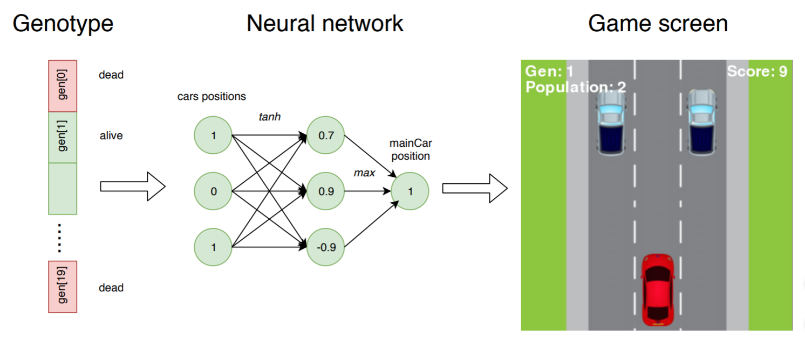

# NEAT-example

Training program based on NEAT. Main goal: train AI for playing simple race game.

## Game rules

1. You are a red car on the road with 3 lane.
2. There are vans on the road. Red car is moving faster and have to overtake them choosing right lane.
3. Red car has always at least 1 lane for overtaking other vans. For each van red car receives 1 point.
4. To win you have to achieve 200 points. If car crashes before, you loose.

## Training rules

Note: all parameters can be changed in config file or main script

1. 20 genotypes with 20 genomes for each.
2. While genome overtakes vans, he is alive.
3. Loose gives penalty for genome for 5 points and kills genome.
4. Network has 3 input and output layers (size of the road), 0 hidden layers, activation function - tanh.
5. If at least 1 genome win the game, he will be written in .pickle file at the end.

## Example

## Requirements

1. Python 3
2. Packages: neat, pygame, math

## Launch

On cmd open project directory and print: python start.py